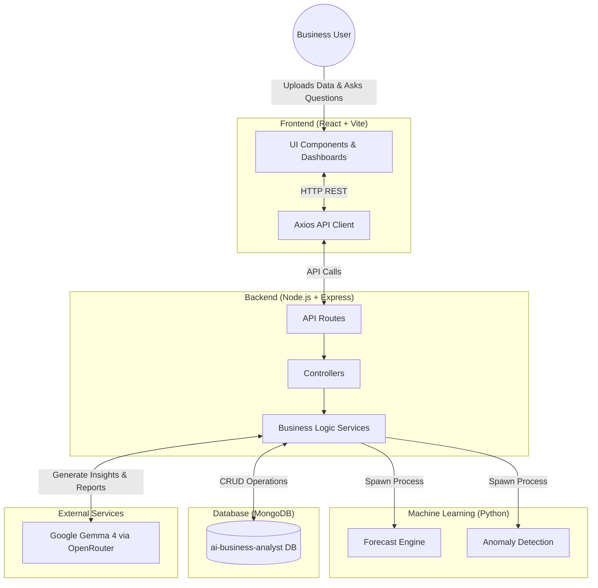

# AI Business Analyst 📊

An AI-powered Business Intelligence platform that allows business users to upload datasets, automatically generate insights, analyze trends, forecast future performance, detect anomalies, and ask natural language questions about their data.

## Features

- 🔐 **Authentication** — Register, login, JWT-based auth
- 📁 **Multiple Projects** — Organize analyses by project
- 📤 **Dataset Upload** — CSV and XLSX file support
- 📊 **Data Profiling** — Auto-detect data types, missing values, duplicates
- 🏥 **Data Quality** — Health score and quality metrics
- 📈 **KPI Detection** — Auto-identify revenue, profit, orders, CTR, etc.
- 📉 **Analytics Dashboard** — Trends, segments, top/bottom performers
- 🤖 **AI Insights** — Ask business questions in natural language
- 🔮 **Forecasting** — Predict future metrics using Linear Regression
- ⚠️ **Anomaly Detection** — IQR-based outlier detection
- 📄 **Executive Reports** — PDF generation with AI-written content

## Architecture



## Tech Stack

| Layer | Technologies |
|-------|-------------|
| Frontend | React, Vite, Ant Design, Recharts, Axios |
| Backend | Node.js, Express.js |
| Database | MongoDB |
| Auth | JWT, bcrypt |
| AI | Google Gemma 4 (via OpenRouter) |
| ML | Python, scikit-learn, pandas, numpy |
| Reports | PDFKit |

## Quick Start

### Prerequisites

- Node.js 18+
- MongoDB (local or Atlas)
- Python 3.8+ (for ML features)

### 1. Clone and Install

```bash
# Install backend dependencies
cd backend
npm install

# Install frontend dependencies
cd ../frontend
npm install

# Install Python ML dependencies
cd ../backend
pip install -r ml/requirements.txt
```

### 2. Configure Environment

Edit `backend/.env`:

```env
MONGO_URI=mongodb://localhost:27017/ai-business-analyst
JWT_SECRET=your_secret_key_here
PORT=5001
OPENROUTER_API_KEY=your_openrouter_api_key_here
```

### 3. Run the App

```bash
# Terminal 1: Start backend
cd backend
npm run dev

# Terminal 2: Start frontend
cd frontend
npm run dev
```

Open http://localhost:5173 in your browser.

### 4. Sample Data

Sample CSV files are available in `backend/sample-data/`:
- `sales_data.csv` — Sales by region, product, category
- `marketing_data.csv` — Campaign performance metrics
- `customer_data.csv` — Customer segments and retention
- `inventory_data.csv` — Stock levels and unit sales
- `finance_data.csv` — Department revenue, expenses, budget

## API Endpoints

| Method | Endpoint | Description |
|--------|----------|-------------|
| POST | `/api/auth/register` | Register new user |
| POST | `/api/auth/login` | Login |
| GET | `/api/auth/me` | Current user |
| POST | `/api/projects` | Create project |
| GET | `/api/projects` | List projects |
| DELETE | `/api/projects/:id` | Delete project |
| POST | `/api/projects/:id/upload` | Upload dataset |
| GET | `/api/projects/:id/datasets` | List datasets |
| GET | `/api/projects/:id/analytics` | Full analytics |
| GET | `/api/projects/:id/kpis` | KPI detection |
| GET | `/api/projects/:id/segments` | Segment analysis |
| GET | `/api/projects/:id/forecast` | Forecasting |
| POST | `/api/projects/:id/ask` | Ask AI question |
| POST | `/api/projects/:id/generate-insights` | Auto insights |
| POST | `/api/projects/:id/report` | Generate report |
| GET | `/api/projects/:id/report` | List reports |

## Project Structure

```
ai-business-analyst/
├── backend/
│   ├── config/db.js
│   ├── controllers/
│   ├── middleware/authMiddleware.js
│   ├── ml/forecast.py, anomalyDetection.py
│   ├── models/User, Project, Dataset, Report
│   ├── routes/
│   ├── services/
│   ├── sample-data/
│   └── server.js
├── frontend/
│   ├── src/
│   │   ├── components/
│   │   ├── context/AuthContext.jsx
│   │   ├── pages/
│   │   ├── services/api.js
│   │   └── App.jsx
│   └── index.html
└── README.md
```